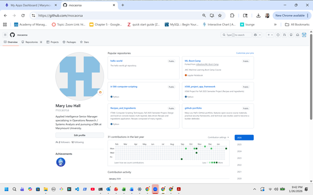

# Lab 03: Zero Trust Policy Profile
**Name:** Mary Lou Hall
**Course:** IT520
**Date:** March 2, 2026  
**Status:** Completed  

## 🎯 Objective
Define the three fundamental ZTA components and design a simple access policy for a sensitive resource within a Critical Infrastructure (CI) context, demonstrating how security signals are used by the Policy Engine.

## 🛠️ Tools Used
* [Mermaid](https://github.com/mermaid-js/mermaid) (Policy Engine)
* Linux Terminal

## 🔍 ZT Component Definitions
1. **Policy Engine (PE):** The Policy Engine is the decision-maker. It evaluates identity, device status, context, and risk signals, then determines whether access should be allowed or denied.

2. **Policy Administration (PA):** The Policy Administrator acts on the decision made by the Policy Engine. It establishes, modifies, or terminates access sessions according to the PE’s instructions.

3. **Policy Enforcement (PEP):** The Policy Enforcement Point is the gatekeeper. It sits in front of the protected resource and allows or blocks traffic based on instructions from the Policy Administrator.

## 💡 Golden State Water Treatment Facility - Core Principle Application 

### Zero Trust Principles Referenced

1. **Verify Explicitly** – Authenticate and authorize using identity, device, location, risk, and behavior signals.  
2. **Least Privilege Access** – Limit access by role, action, and time.  
3. **Assume Breach** – Monitor continuously and contain abnormal behavior.  
4. **Micro-Segmentation** – Enforce network and resource isolation.  
5. **Continuous Monitoring & Validation** – Ongoing posture and session evaluation.  

**The IT (HR) System Focus → Confidentiality**
•	Protect employee PII
•	Prevent insider data theft
•	Enforce encryption and DLP
•	Continuous behavioral monitoring

**OT Focus → Safety & Availability**
•	Protect SCADA command integrity
•	Restrict PLC configuration access
•	Enforce change control validation
•	Segmentation between IT and OT zones

---

## ZTA Policy Table
The following ZTA Policy Table provides a distinct policy evaluation by the Policy Engine. For the case study Golden State Water Treatment facility we imagine that there will be **HR System** will be comprised of the HR Files with Certification, Payroll and Administrative Records, and that the **Operational Systems** would include the SCADA Control System and components such as the Chemical Dosing System, Water Quality Monitoring, Pump Stations etc. The following table illustrates some reasonable ZTA policies for each of these resources including the inputs, condition, and enforcement.  The far right column describes the Zero Trust Principle(s) accomplished.

| RESOURCE | SIGNAL (INPUTS) | CONDITION | ENFORCEMENT | ZERO TRUST PRINCIPLE ACCOMPLISHED |
|-----------|----------------|------------|--------------|------------------------------------|
| HR-Files-Server | User Group + Device Health + Location | “HR Admin” AND “Corp Device” AND “US-Region” | ALLOW via Identity-Aware Proxy | Verify Explicitly + Micro-Segmentation |
| HR-Files-Server | User Risk Score + MFA Strength | Risk = Low AND Phishing-Resistant MFA | ALLOW; else Step-Up Auth | Verify Explicitly |
| HR-Files-Server | Device Compliance + EDR | MDM-Enrolled AND No Critical Vulns | BLOCK if non-compliant | Continuous Monitoring |
| Certification-Records-System | Role + Action Type | Analyst = Read Only; Admin = Write/Export | RBAC + DLP | Least Privilege |
| Payroll-PII-Repository | Network Path + TLS Version | Access only via ZTNA Gateway; TLS 1.2+ | Block Direct Access | Micro-Segmentation |
| All HR Systems | Data Transfer Volume + Behavioral Baseline | Export must match normal baseline | Quarantine Session + SOC Alert | Assume Breach |
| HR-Admin-Portal | Privileged Role + JIT Approval | Time-bound access ≤4 hrs | PAM Approval + Session Recording | Least Privilege + Assume Breach |
| SCADA-Control-System | Role + Network Zone | “OT Operator” AND OT Network Segment | Allow via ZTNA Gateway | Micro-Segmentation |
| SCADA-Control-System | Privilege Level + Command Type | Only “OT Engineer” may change configs | MFA + Full Command Logging | Least Privilege |
| PLC-Controllers | Device Certificate + Mutual TLS | Authenticated engineering workstation only | Block All Others | Verify Explicitly |
| Chemical-Dosing-System | Role + Change Ticket | Parameter changes require approved ticket | Ticket Validation + Session Recording | Verify Explicitly + Assume Breach |
| Water-Quality-Monitoring-System | Action Type | Operators = Read Only; Supervisors = Adjust | Enforce RBAC | Least Privilege |
| Historian-Database | Export Volume + Supervisor Approval | >100MB requires approval | Step-Up Auth + Alert | Assume Breach |
| Remote-Pump-Stations | VPN + Device Health + Location | Managed VPN AND Corp Device | Block if unmanaged | Verify Explicitly |
| OT Jump Server | Privileged Role + Maintenance Window | Admin access only during change window | JIT PAM Access + Session Recording | Least Privilege + Continuous Validation |

---

## 📸 Proof of Work

